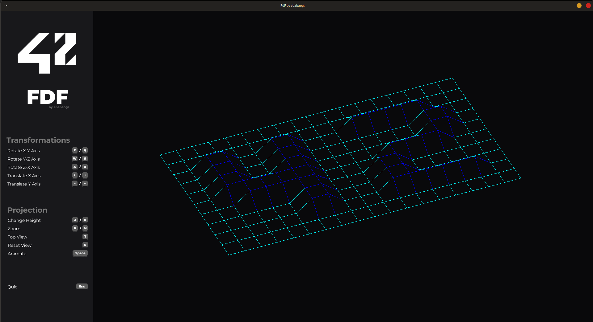

<div align="center">
    
    <h1>fdf</h1>
</div>


🖼️ A graphics program that visualizes 3D wireframe projections.

## About
FdF is a foundational graphics project in the 42 curriculum that involves creating a program capable of rendering 3D wireframe models in a 2D environment. The project challenges students to use mathematical concepts such as isometric projections and implement fundamental graphics programming techniques, including managing the window display, handling user interactions, and drawing lines efficiently. By completing FdF, students gain a deeper understanding of computer graphics, coordinate transformations, and algorithm optimization.

## Preview


### References
- https://en.wikipedia.org/wiki/Rotation_matrix
- https://en.wikipedia.org/wiki/Digital_differential_analyzer_(graphics_algorithm)
- https://harm-smits.github.io/42docs/libs/minilibx

## Install & Usage (Linux)
### Prerequisites
- [MinilibX](https://github.com/42Paris/minilibx-linux)
- MinilibX requires the following packages to be installed:
```bash
sudo apt-get install xorg libxext-dev zlib1g-dev
```

### Installation
1. Clone the repository recursively to include the MinilibX submodule:
```bash
git clone --recursive https://github.com/lareii/fdf.git
```

2. Build the project:
```bash
make # 'make bonus' for bonus version
```

### Usage
Run the program with a map file as an argument:
```bash
./fdf maps/42.fdf
```
Ta-da! 🥳 You should see a 3D wireframe projection of the map.

## Contributing
Contributions are welcome! If you would like to contribute to this project, please open a pull request.